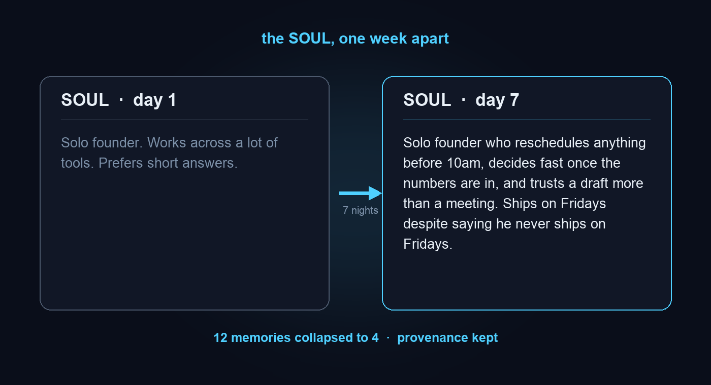

<div align="center">


# sidanclaw

### Brain, agent, workflows, and docs.

**You make the calls. It does the rest.**

[](https://github.com/sidanclaw/sidanclaw/actions/workflows/ci.yml)
[](https://github.com/sidanclaw/sidanclaw/stargazers)
[](./LICENSE)

</div>

---

Every other AI meets you for the first time, every time. You re-explain your
whole company every morning, like the guy in Memento.

sidanclaw is an open, self-hosted AI for solo founders, indie hackers, and small
teams. It runs on your machine, learns how your work actually happens, and then
does the work: drafts the reply, runs the workflow, files the doc, updates the
record. You stay on the decisions. It handles the rest.

## What it does

- **Brain.** Remembers your company (people, deals, decisions, the mess you drop
  on it) and builds a knowledge graph you can open and read.
- **Agent.** A chat that acts through your own tools and connectors. You make the
  call, it does the rest: research, draft, send, update.
- **Workflows.** Multi-step automations that run on a schedule or a trigger, with
  conditions and approvals. Set the rule once, it runs without you.
- **Docs.** A collaborative canvas where the work lands and the agent writes back.
  Notion-style, synced on your machine.

## And it dreams

A vector database remembers what you said. sidanclaw decides what it meant, throws
out the duplicates, and writes down who you are. One is storage. The other sleeps
on it.

While you are away it **dreams**: a background loop (Light / REM / Deep)
consolidates what it learned, collapses duplicate memories, and rewrites a
**SOUL**, an evolving portrait of how you think, work, and decide. Feed it a week
of notes, and by day seven it knows you reschedule anything before 10am and trust
a draft more than a meeting. The better it knows you, the closer the rest it does
gets to the call you would have made yourself.

Yes, it dreams about you. We sat with how that sounds. It still ships on by
default.

<div align="center">

</div>

## Quick start

**Prerequisites:** Node 22+, pnpm 10+, and a free Gemini API key
([get one here](https://aistudio.google.com/apikey)).

```bash
git clone https://github.com/sidanclaw/sidanclaw.git
cd sidanclaw
export GEMINI_API_KEY=...   # or let the launcher prompt you; persisted under ~/.sidanclaw/
pnpm install
pnpm dev                    # api + canvas sidecar + web app, opens your browser
```

That is it. There is no step three. The store defaults to an embedded PGLite
database under `~/.sidanclaw/`; point `DATABASE_URL` at a local Postgres if you
prefer a container. Optional capability keys (web search, X search, model
fallback) and self-host overrides live in [`.env.example`](./.env.example).

### Your data stays yours

**0** external services. **1** model key. The brain, the store, and the canvas
all stay local; the only outbound call sidanclaw makes is to the Gemini API with
your own key. Nothing else about your work leaves your machine.

## What's in the box

| Layer | What it does |
|---|---|
| **Engine** | Query loop, tool executor, compaction, provider abstraction. |
| **Brain** | Memory, hybrid retrieval (RRF + MMR), an entity / edge / task graph, a knowledge base, and the consolidation / dreaming loop with SOUL synthesis. |
| **Agent** | A chat loop that uses your tools and connectors to do the work, not describe it. |
| **Workflows** | Multi-step automations that run on a schedule or a trigger, with conditions and approvals. |
| **Docs** | A collaborative document surface, the canvas, where the work lands (runs a local sync sidecar). |
| **App** | The desktop and web frontend. |

## Growing into a team

sidanclaw is single-player by design, like most of your actual work. When you add
a teammate, the app offers a one-click migration to the hosted version, no
re-entry. The paywall is a capability (a shared, always-on team graph that cannot
exist single-player), never a nag.

## Troubleshooting

A clean first boot is a little chatty. Two log lines are expected and safe to
ignore:

- **`[registry] No community connectors (sidanclaw-tools not present)`** (and the
  matching skills line). The optional community registry lives in a separate
  `sidanclaw-tools` submodule a default clone does not pull. Run
  `git submodule update --init sidanclaw-tools` if you want it; otherwise the
  built-in official connectors are all you need.
- **`bind message supplies 2 parameters, but prepared statement "" requires 1`**
  from a consolidation tick: a known quirk of the embedded PGLite store on one
  query. Non-fatal, retries automatically. Point `DATABASE_URL` at a local
  Postgres to avoid it entirely.

## License

**AGPLv3** ([`LICENSE`](./LICENSE)): real, OSI and FSF approved open source with a
network-copyleft clause. Run a modified sidanclaw as a hosted service and you
publish your changes. We will be reading. A commercial license is available for
orgs that cannot accept AGPL, powered by the [CLA](./CLA.md) every contributor
signs.

## Contributing & security

Start with [`CONTRIBUTING.md`](./CONTRIBUTING.md) (CLA + how we work). For
vulnerabilities, see [`SECURITY.md`](./SECURITY.md), and please do not open a
public issue.

## Star the repo

If this resonates, [star it](https://github.com/sidanclaw/sidanclaw). It helps
more people find their own brain. Or star it because your current AI has the
memory of a goldfish. Either way.
