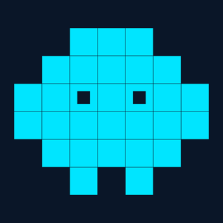
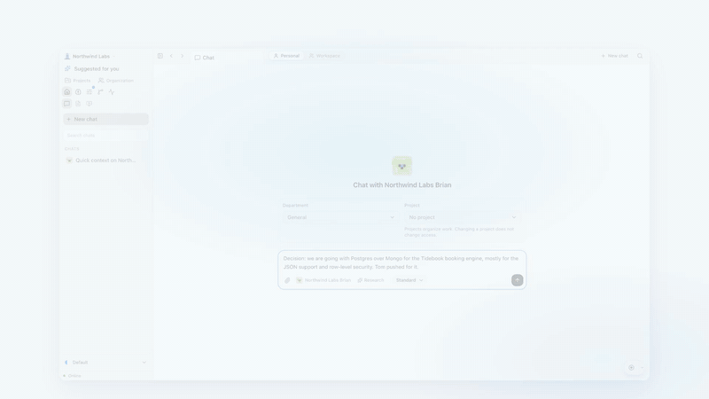
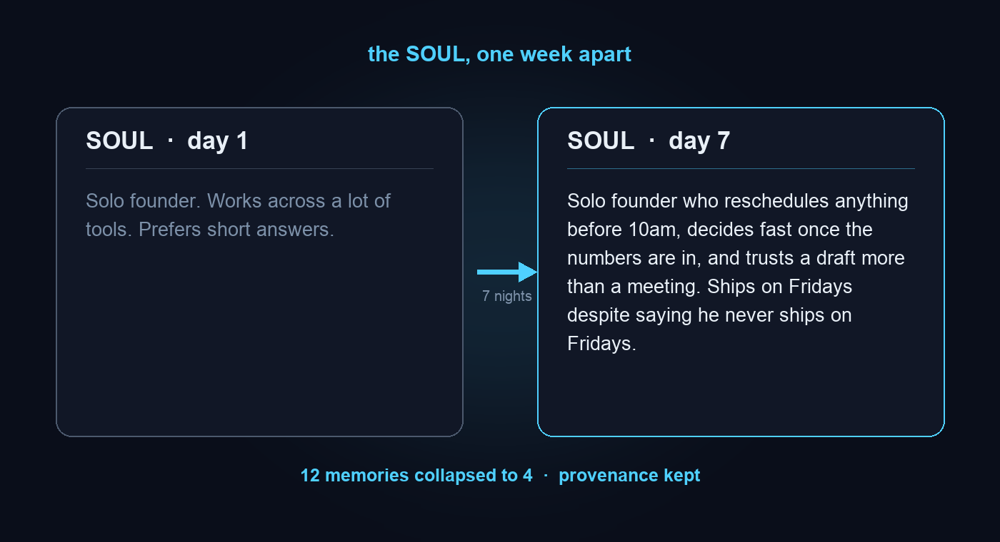

<div align="center">



# Use Brian

### Brain, agent, workflows, and docs.

**You make the calls. It does the rest.**

[usebrian.ai](https://usebrian.ai) · [Docs](https://usebrian.ai/docs) · [Hosted app](https://app.usebrian.ai) · [Self-hosting](./docs/self-hosting.md) · [Services](https://studio.usebrian.ai)

[](https://github.com/use-brian/use-brian/actions/workflows/ci.yml)
[](https://github.com/use-brian/use-brian/stargazers)
[](./LICENSE)

</div>

<p align="center"></p>

---

Every other AI meets you for the first time, every time. You re-explain your
whole company every morning, like the guy in Memento.

Use Brian is an open-source, self-hosted company brain for solo founders and
small teams. It learns how your work actually happens, then does the work:
drafts the reply, runs the workflow, files the doc, updates the record. You
stay on the decisions.

## Quick start

You need Node 22+, pnpm 10+, and one model credential (a free
[Gemini API key](https://aistudio.google.com/apikey) works) or an eligible
ChatGPT subscription.

```bash
git clone https://github.com/use-brian/use-brian.git
cd use-brian
pnpm install
pnpm dev      # pick a model backend; your browser opens
```

There is no step three. Data lives in an embedded database under
`~/.usebrian/`. Postgres, containers, channels, and every optional key are in
[`docs/self-hosting.md`](./docs/self-hosting.md).

## What it does

| | |
|---|---|
| **Brain** | Remembers people, deals, decisions, and the mess you drop on it, as a knowledge graph you can open and read. Chats, email, and meeting recordings all land here. |
| **Agent** | A chat that acts through your tools: research, draft, send, update. It can drive your own signed-in browser, one permitted tab at a time. |
| **Workflows** | Schedules and triggers with conditions and approvals. Set the rule once. |
| **Docs & Office** | Pages, documents, presentations, and spreadsheets the agent writes into, with PDF export and share links. |
| **Channels** | Web, desktop, Telegram, Slack, Discord, WhatsApp, WeChat, Microsoft Teams, Feishu, and email. |
| **Dreams** | While you are away it consolidates what it learned. More on that below. |

Also in the box: a CRM, campaigns with first-party attribution
([guide](./docs/campaigns.md)), a public API, and an MCP server so your other
agents can use the brain too.

## Five minutes in

The app opens with a chat dock on every screen. Try three things:

1. **Tell it something.** "We are going with Postgres over Mongo, mostly for
   the JSON support, Raph pushed for it." The decision, the reason, and who was
   involved land in the brain. No forms.
2. **Ask it to do something.** "Draft a changelog note for that and save it as
   a doc." It writes to the canvas, asking first before anything that sends or
   changes data.
3. **Set a rule once.** "Every Monday at 9am, summarize last week's
   decisions." That is now a workflow.

## What it asks before doing

Every tool is governed by what it does, fail-closed:

- **Reads run on their own.** Search, list, fetch.
- **Writes ask first.** Send, create, update, until you say "always" for one.
- **Destructive actions stay blocked.** Delete, revoke, cancel, until you turn
  them on per tool.

A fresh install reads and drafts freely. It cannot send an email without you.

## And it dreams

Overnight it rewrites a **SOUL**: an evolving portrait of how you think, work,
and decide. The better it knows you, the closer the rest lands to your own
call.

<p align="center"></p>

Yes, about you. We sat with how that sounds. It still ships on by default, and
it lives in your own database like everything else.

## Connectors

Built in: Gmail, Google Calendar, Google Drive, Notion, GitHub, Fathom,
Shopify, WordPress, Google Search Console, Microsoft 365, IMAP email, and
storage on GCS, S3, or a local directory. Any MCP server, remote or a local
CLI, plugs in as a custom connector. The read / write / destructive policy
above covers every one of them.

## Models

Gemini (AI Studio or Vertex), Qwen and DeepSeek via DashScope, any
OpenAI-compatible endpoint, or your ChatGPT subscription (Beta). Claude can
stand by as an outage fallback. Details in
[`docs/self-hosting.md`](./docs/self-hosting.md#model-backends).

## Your data stays yours

The brain, the database, and the files stay on your machine. Model requests go
only to the backend you pick. Connectors and search providers call out only
when you turn them on. No "your data is important to us" email three years
from now.

## Hosted, and hands-on help

[usebrian.ai](https://usebrian.ai) is the same product, run for you. Sign in at
[app.usebrian.ai](https://app.usebrian.ai), nothing to keep alive, and when you
add teammates the app migrates your self-host in one click.

Want it wired into your company for you? [Brian Studio](https://studio.usebrian.ai)
does AI ops audits, implementation, and training, from the team that builds
Use Brian. Write to [sales@usebrian.ai](mailto:sales@usebrian.ai).

## License

**AGPLv3** ([`LICENSE`](./LICENSE)). Run a modified Use Brian as a hosted
service and you publish your changes. We will be reading. A commercial license
is available for orgs that cannot accept AGPL, made possible by the
[CLA](./CLA.md) every contributor signs.

## Contributing & security

Start with [`CONTRIBUTING.md`](./CONTRIBUTING.md). For vulnerabilities, see
[`SECURITY.md`](./SECURITY.md) and please do not open a public issue.

If this resonates, [star it](https://github.com/use-brian/use-brian). Or star
it because your current AI has the memory of a goldfish. Either way.
